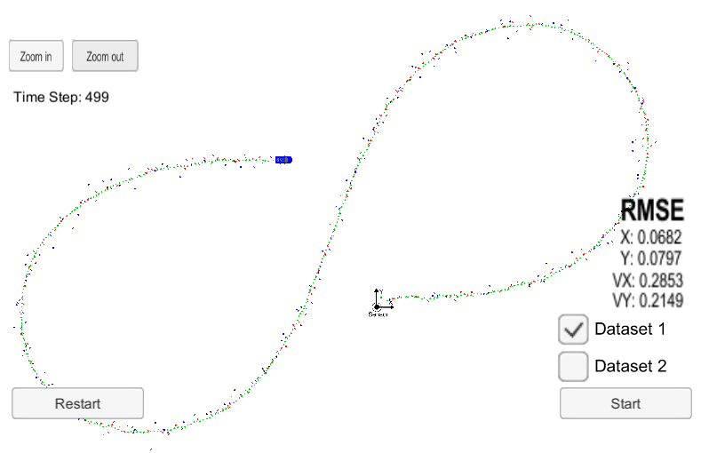

# Unscented Kalman Filter

In this project, I implemented an __Unscented Kalman Filter__ in C++ that receives Lidar and Radar input data to estimate an object's position and velocity in the plane.

My submissions includes the following files:

- __ukf.cpp__: Implementation of the Unscented Kalman Filter (UKF) with proper initialization. It contains the functions ProcessMeasurement, Prediction, UpdateLidar, and UpdateRadar.
- __ukf.h__: Corresponding header-file. Initialization of some additional variables.
- __tools.cpp__: Calculation of the root mean squared error compared to the ground truth.

## Project Specifications

In the following, I will address all rubric points.

### Compiling

My operating system is Windows 10. I used _Bash on Ubuntu on Windows_. All coding was done in C++. The code compliles without errors.

### Accuracy

To meet the specifications, the RMSE of [px, py,vx, vy] must be lower or equal to [.09, .10, .40, .30] on the first dataset. The following table shows my results:

| Used sensors | RMSE |
| :------------: |  ----: |
| both | .069 .080 .286 .215 |
| lidar | .099 .096 .526 .351 |
| radar | .155 .226 .340 .309 |

### Correct Algorithm

I implemented the Unscented Kalman filter in the .cpp files mentioned above. In particular, I implemented the initialization and the update steps for both sensors.

To initialize the variables x, P, std_a, std_yawdd, I implemented the Normalized Innovation Squared (NIS). The NIS is Chi-Squared distributed and this helps to indicate in which way one has to change the initial values to better the UKF.

### Code Efficiency

For all calculations, I stored all values that are reused in separate variables. This increases the memory amount used but the speed of the algorithm benefits. This is important since these algorithms have to run in real-time.

## Discussion

We can see that the UKF achieves good results. If we only use the radar or the lidar sensor, the results are slightly worse. In particular, lidar seems to better predict the position and radar seems to better predict the velocity of the object.

If we compare the UKF to the EKF from last lesson, we obtain:

| Filter | RMSE |
| :------------: |  ----: |
| UKF | .069 .080 .286 .215 |
| EKF | .098 .085 .409 .470 |

We can see that the UKF seems to work better than the EKF, especially in terms of velocity.
